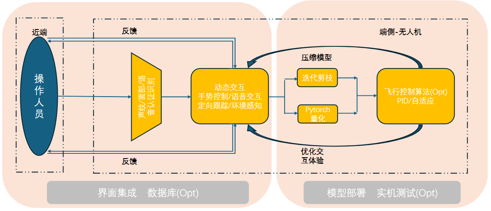
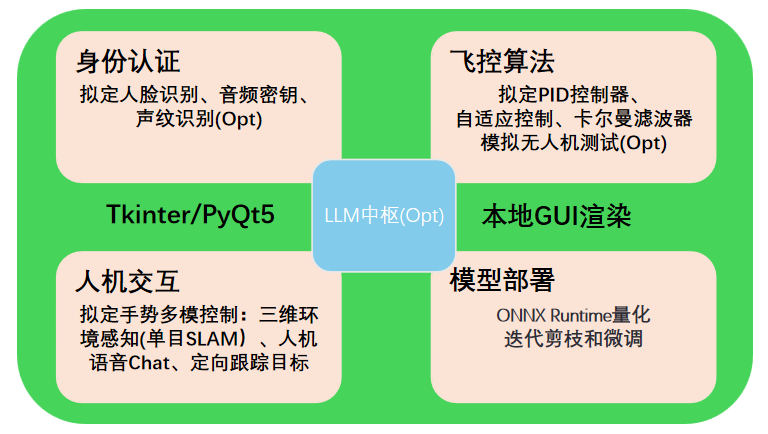

# :rocket: MMChat Project Guide :rocket:

___Project Introduction___: MMChat aims to combine current cutting-edge technologies and published big language models to build a dynamic and interactive multi-modal platform, covering vision, language, 3D, text processing and other aspects of processing. Among them, MMChat includes facial recognition, audio command classification and recognition, gesture detection, big language model interaction, 3D stereo perception and many other technologies. And this repo provides an integrated GUI interface based on the tkinter framework, which is convenient for users to use. If you have the opportunity in the future, you can try to deploy the code and model on the end-side device for intelligent information perception testing.

___Detailed Explanation___: The authentication part is proposed to use facial recognition technology based on facenet-pytorch/dlib, authentication and recognition technology based on audio key, and voiceprint recognition technology; In the human-machine interaction part, LLM with small parameters is proposed as the central control system for human-machine interaction; Interaction functions mainly include the use of gesture recognition as a basic means of controlling multimodal interaction to enable monocular SLAM, target object tracking technology, voice communication and other functions; Try to use model pruning and model quantization techniques to compress the model to adapt to mobile end devices; Finally, if time permits, learn the PID control algorithm of the flight control algorithm to optimize the system interaction experience.

## 1.Runtime Environment :computer:

MMChat is developed using python3.10, and the relevant dependencies are as follows：

| Package Name | Version | Package Name | Version |
| :---: | :---: | :---: | :---: |
| numpy | 1.21.2 | opencv-python | 4.5.3.56 |
| torch | 1.10.0 | torchvision | 0.11.1 |
| pytorch-lightning | 1.4.9 | transformers | 4.18.0 |
| ollama | 2.0.2 | flask-socketio | 5.1.2 |

## 2.TODO List :clipboard:

- [ ] Complete identity authentication model design and system deployment: face authentication, audio key authentication, voiceprint authentication  
- [ ] Design monocular SLAM algorithm to achieve basic 3D environment sparse modeling tasks
- [ ] Use YOLOv5 to recognize pedestrians, vehicles, etc. and track objects
- [ ] Complete the local deployment of small parameter VLM or LLM to achieve interaction with users
- [ ] Use model pruning (Opt) or model quantization to int8/int16 to compress the model
- [ ] If you have time to learn the flight control algorithm PID or other algorithms, optimize the system interaction experience

## 3.System Function :hourglass_flowing_sand:

## Continuously updating
