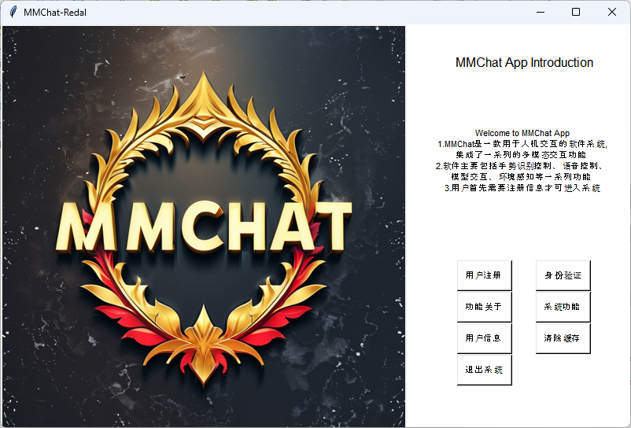

<p align='center'>


</p>

# :rocket: MMChat Project Guide :rocket:

<p align='center'>

</p>

___Project Introduction___: MMChat aims to combine current cutting-edge technologies and published big language models to build a dynamic and interactive multi-modal platform, covering vision, language, 3D, text processing and other aspects of processing. Among them, MMChat includes facial recognition, audio command classification and recognition, gesture detection, big language model interaction, 3D stereo perception and many other technologies. And this repo provides an integrated GUI interface based on the tkinter framework, which is convenient for users to use. If you have the opportunity in the future, you can try to deploy the code and model on the end-side device for intelligent information perception testing.

<p align='center'>

</p>

___Detailed Explanation___: The authentication part is proposed to use facial recognition technology based on facenet-pytorch/dlib, authentication and recognition technology based on audio key, and voiceprint recognition technology; In the human-machine interaction part, LLM with small parameters is proposed as the central control system for human-machine interaction; Interaction functions mainly include the use of gesture recognition as a basic means of controlling multimodal interaction to enable monocular SLAM, target object tracking technology, voice communication and other functions; Try to use model pruning and model quantization techniques to compress the model to adapt to mobile end devices; Finally, if time permits, learn the PID control algorithm of the flight control algorithm to optimize the system interaction experience.

## 1.Runtime Environment :computer:

MMChat is developed using python3.10, and the relevant dependencies are as follows：

| Package Name | Version | Package Name | Version |
| :---: | :---: | :---: | :---: |
| numpy | 1.21.2 | opencv-python | 4.5.3.56 |
| torch | 1.10.0 | torchvision | 0.11.1 |
| pytorch-lightning | 1.4.9 | transformers | 4.18.0 |
| ollama | 2.0.2 | flask-socketio | 5.1.2 |

## 2.TODO List :clipboard:

- [x] Complete identity authentication model design and system deployment: face authentication, audio key authentication, voiceprint authentication  
- [ ] Realize the generation of 3D scene images from a single image
- [ ] Use YOLOv5 to recognize pedestrians, vehicles, etc. and track objects
- [x] Complete the local deployment of small parameter VLM or LLM to achieve interaction with users
- [ ] Use model pruning (Opt) or model quantization to int8/int16 to compress the model
- [ ] If you have time to learn the flight control algorithm PID or other algorithms, optimize the system interaction experience

## 3.Software Framework :moon:

According to the project, if you would like to use the GUI interface, you can use the tkinter framework. The relevant code file can be found in the [app_redal.py](app_redal.py). The python file is main file in the project. Also, we offer a webpage python file to chat with the LLM/VLM model, which is in the [streamlit.py](streamlit.py). However, please note that after running streamlit.py, VScode IDE will automatically open the web page loading model, etc., and you need to start a conversation on the corresponding web page.

```bash
# if you want to run the GUI
python app_redal.py

# if you want to run the webpage
streamlit run streamlit.py
```

Next, let me introduce the framework of the whole interface design for you in detail. I will introduce in detail the MMChat main interface, user information entry interface, identity verification interface, system checkbox interface, gesture static and dynamic interface, style transfer interface, LLM model communication interface, VLM model communication interface and object detection interface.  
  
___app redal__The above picture is the main interface, which mainly includes the overall logo of the MMChat system, a brief introduction to the system, and various functions of the main page. Finally, it also includes user registration, authentication, function information, system functions, and many other model designs. The user information entry mainly uses the dlib-based face_recognize to obtain the face embedding, personal password and personal name, and stores it in the form of {name: embedding} in the data_cached folder [face_emb.json](data_cached/face_emb.json) and [password_emb.json](data_cached/password_emb.json) files. The code is in the [app_redal.py](app_redal.py).

## 4.System Function :hourglass_flowing_sand:

___Face Recognition___: We selected dlib, facenet, and face-recognition for facial recognition tasks - Python third-party libraries for recognition. But finally, face-recognition with a higher degree of integration is used for face authentication and face verification tasks. And the face recognition code is bellow and you can see the code in the [python file](./models/face_cls_model.py). Then save the obtained face name and embedding in the cache folder, and then use face verification to verify. The relevant code file can be found in the [top_mes.py](utils/top_mes.py).

```python
class FaceRecognition(object):
      """use face-recognition model to recognize face and
      recognise all the faces in the frame, format [1, 128]
      :param input: the camera RGB frame, format cv2-ndarray
      :param return: the face descriptors format list
      :param args: generated by config function """
      def __init__(self, args, **kwargs):
            self.args = args
      def __extract__(self, input_img, all_faces=False):
            # extract all faces encodings 
            self.input = np.array(input_img)
            face_locations = fr.face_locations(self.input)
            if all_faces: 
                  face_encodings = fr.face_encodings(self.input, face_locations)
                  return face_locations, face_encodings
            else: 
                  face_encodings = fr.face_encodings(self.input, face_locations[0:1])
                  return face_locations[0:1] ,face_encodings
      def __compare__(self, input_img, json_fpath):
            # compare the face encodings with the known face encodings
            with open(json_fpath, 'r')  as f:
                  known_dict = f.load()
                  known_encodings = known_dict['encodings']
                  known_names = known_dict['names']
            pil_img = Image.fromarray(input_img)
            draw_img = ImageDraw.Draw(pil_img)
            # compute current frame faces encodings
            face_locations, face_encodings = self.__extract__(input_img, all_faces=True)
            for [up, left, bottom, right], face_encoding in zip(face_locations, face_encodings):
                  matches = fr.compare_faces(known_encodings, face_encoding)
                  if True in matches:
                        name = known_names[matches.index(True)]
                  else: name = 'Unknown'
                  # plot known face name and bounding box
                  draw_img.rectangle([left, up, right, bottom], outline=(0, 0, 255))
                  draw_img.text((left, up - 10), name, fill=(0, 0, 255))
            return np.array(pil_img)
```

___Model Deployment___: This time, we use the Ollama model deployment method to realize the local deployment of the model. The local deployment models include: llava: latest, llava: 7b, deepseek-r1:1.5b, qwen2.5:1.5b, internlm2:1.8b. Among them, llava: latest, llava: 7b belong to the visual language large model, deepseek-r1:1.5b, qwen2.5:1.5b, internlm2:1.8b belong to the strong inference language large model. At the same time, I also plan to try to quantify the new [Qwen 2.5-Omni](https://huggingface.co/Qwen/Qwen2.5-Omni-7B): 7b full-mode model from HuggingFace local deployment to improve the comprehensive expression ability of the system.

|  Model Name  |  Model ID  |  model size  |
| ------------ | ---------- | ------------ |
| llava:latest |8dd30f6b0cb1|    4.7 GB    |
| llava:7b     |8dd30f6b0cb1|    4.7 GB    |
|deepseek-r1:1.5b|a42b25d8c10a|    1.1 GB  |
|qwen2.5:1.5b  |65ec06548149|    986 MB    |
|internlm2:1.8b|653be3eb69a0|    1.1 GB    |

___Ollama Installation___: Of course, the specific method of calling the model is as follows. You can install Ollama on the official website and run the command to deploy the model locally. At the same time, the code of the relevant substitute model is as follows, you can read the relevant usage method in this [Python file](models/llm_chat_model.py). Finally, it is planned to use [ollama.cpp](https://github.com/ggml-org/llama.cpp/) to quantify the model to reduce the video memory consumption on the local computer.

```bash
pip install ollama
ollama run llava:latest
ollama run llava:7b
ollama run deepseek-r1:1.5b
ollama run qwen2.5:1.5b 
ollama run internlm2:1.8b
```

```python
def ollama_generator(prompt):
      """Use the ollama local llms to generate the response
      :param prompt: the prompt of the user"""
      args = config()
      with open('./api/content.txt', 'r', encoding='utf-8') as f:
            content=f.read()
      prompt = f"""请按照上述的要求回答{content}以下问题：{prompt}"""
      generator = ollama.generate(
            model = args.ollama_key,
            prompt = prompt,
            stream = False,)
      return generator['response']
```

___Interface Design___: The interface design of the software is completed by multi-interface and multi-threading, mainly including the information registration of the [main interface](app_redal.py), the face of the identity verification interface, the password [verification function](app_authoriztion.py), the gesture drone control of the main control interface of the [system function](app_sysfunc.py), the LLM model dialogue, the environment perception of the VLM model, the environment object detection (YOLOv5) and other functions and their sub-interface design.

## Continuously updating
