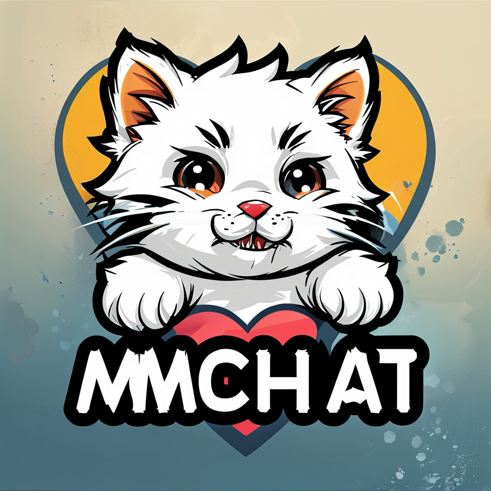
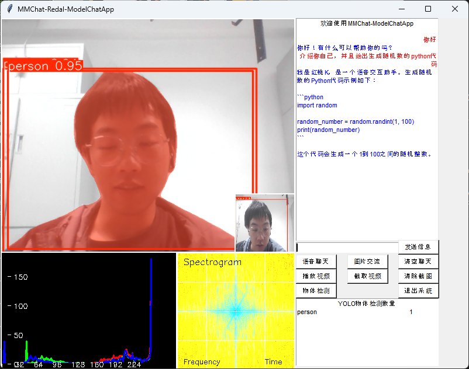

<p align='center'>


</p>

# :rocket: MMChat Project Guide :rocket:

<p align='center'>

</p>

___Project Introduction___: MMChat aims to combine current cutting-edge technologies and published big language models to build a dynamic and interactive multi-modal platform, covering vision, language, 3D, text processing and other aspects of processing. Among them, MMChat includes facial recognition, audio command classification and recognition, gesture detection, big language model interaction, 3D stereo perception and many other technologies. And this repo provides an integrated GUI interface based on the tkinter framework, which is convenient for users to use. If you have the opportunity in the future, you can try to deploy the code and model on the end-side device for intelligent information perception testing.

<p align='center'>

</p>

___Detailed Explanation___: The authentication part is proposed to use facial recognition technology based on facenet-pytorch/dlib, authentication and recognition technology based on audio key, and voiceprint recognition technology; In the human-machine interaction part, LLM with small parameters is proposed as the central control system for human-machine interaction; Interaction functions mainly include the use of gesture recognition as a basic means of controlling multimodal interaction to enable monocular SLAM, target object tracking technology, voice communication and other functions; Try to use model pruning and model quantization techniques to compress the model to adapt to mobile end devices; Finally, if time permits, learn the PID control algorithm of the flight control algorithm to optimize the system interaction experience.

## 1.Runtime Environment :computer:

MMChat is developed using python3.10, and the relevant dependencies are as follows：

| Package Name | Version | Package Name | Version |
| :---: | :---: | :---: | :---: |
| numpy | 1.21.2 | opencv-python | 4.5.3.56 |
| torch | 1.10.0 | torchvision | 0.11.1 |
| pytorch-lightning | 1.4.9 | transformers | 4.18.0 |
| ollama | 2.0.2 | flask-socketio | 5.1.2 |

## 2.TODO List :clipboard:

- [x] Complete identity authentication model design and system deployment: face authentication, audio key authentication, voiceprint authentication  
- [x] Use YOLOv11 to recognize pedestrians, vehicles, etc. and track objects
- [x] Complete the local deployment of small parameter VLM or LLM to achieve interaction with users
- [x] Complete the overall GUI interface design of the MMChat system based on tkinter and introduce multithreading for development.
- [ ] Realize the generation of 3D scene images from a single image
- [ ] Use model pruning (Opt) or model quantization to int8/int16 to compress the model
- [ ] If you have time to learn the flight control algorithm PID or other algorithms, optimize the system interaction experience

## 3.Software Framework :moon:

According to the project, if you would like to use the GUI interface, you can use the tkinter framework. The relevant code file can be found in the [app_redal.py](app_redal.py). The python file is main file in the project. Also, we offer a webpage python file to chat with the LLM/VLM model, which is in the [streamlit.py](streamlit.py). However, please note that after running streamlit.py, VScode IDE will automatically open the web page loading model, etc., and you need to start a conversation on the corresponding web page.

```bash
# if you want to run the GUI
python app_redal.py

# if you want to run the webpage
streamlit run streamlit.py
```

|  app_redal   |   app_authorization   |   app_login   |
| :---: | :---: | :---: |
|  |  |  |
| app introduction |   app clear cached   |   app system function   |
| | |  |
| app style transfer |   app gesture recognizer   |   app model chat   |
|  |  |  |

Next, let me introduce the framework of the whole interface design for you in detail. I will introduce in detail the MMChat main interface, user information entry interface, identity verification interface, system checkbox interface, gesture static and dynamic interface, style transfer interface, LLM model communication interface, VLM model communication interface and object detection interface.  
___app redal___: The above picture is the main interface, which mainly includes the overall logo of the MMChat system, a brief introduction to the system, and various functions of the main page. Finally, it also includes user registration, authentication, function information, system functions, and many other model designs. The user information entry mainly uses the dlib-based face_recognize to obtain the face embedding, personal password and personal name, and stores it in the form of {name: embedding} in the data_cached folder [face_emb.json](data_cached/face_emb.json) and [password_emb.json](data_cached/password_emb.json) files. The code is in the [app_redal.py](app_redal.py).  
___app authorization___: The above picture is authorization interface, mainly used to generate a unique user's facial embeddings and get the user's personal password and name. After Finished the authorization, the interface will be destroyed automatically. Also, If you forget to write dwon your name, the temporary interface will change the text to warn you. The code is in the [app_authorization.py](app_authorization.py).  
___app systemfunc___: App systemfunc means the system function interface, which mainly includes basic interaction functions in our system such as gesture recognition, image style transformation, LLM interaction, object detection based on YOLO and so on. When you click the button in the orange box on main interface, waiting for a short time for initializing related settings and then you can choose the function in the check box. The code is in the [app_sysfunc.py](app_sysfunc.py).  
___app modelchat___: The interface is designed to promote multimedia interaction and integrates video playback, image analysis, and chat interaction functions. Users can view real-time video streams through the area on the interface and conduct visual analysis at the same time, such as the display of histograms and spectrograms, to obtain additional levels of information. At the same time, the interface also provides a convenient chat window that supports users to input text messages and communicate with the system or other users, enhancing the interactive experience.The code is in the [app_modelchat.py](app_modelchat.py).  Moreover, the interface also intergrates the object detection and instance segmentation functions which can print the results of yolov model on the interface. Also, the core function - the code implementation of image communication uses ollma to schedule the local models llava:latest and qwen2.5:1.5b for processing and the code is in the [python file](./utils/vlm_prompt.py).  
___app style transfer___: Style transfer mainly includes the traditional Fast Neural Style Transfer (FNST) image style transfer algorithm for controllable transfer degree and the real-time transfer algorithm for arbitrary style image content on image streams that obtain camera data. And the readl-time transfer algorithm is based on the MetaNet and TransformNet through the large amount of training style and content images, which the core of the algorithm is the pre-trained network in the [python file](./models/style_metanet_random.py). As for the GUI interface's code is in the [app_style_transfer.py](app_style_transfer.py).  
___app gesture___: The gesture recognition interface mainly use the mediapipe library for gesture recognition which can input the image consisting of special gesture image and output the coordinate of the gesture's key points. Then in order to implement the function of  gesture control, we create a subsidiary interface to visiualize the drone's movement as the change of the gesture. The code is in the [app_gesture.py](app_gesture_recognizer.py).  

## 4.System Function :hourglass_flowing_sand:

___Face Recognition___: We selected dlib, facenet, and face-recognition for facial recognition tasks - Python third-party libraries for recognition. But finally, face-recognition with a higher degree of integration is used for face authentication and face verification tasks. And the face recognition code is bellow and you can see the code in the [python file](./models/face_cls_model.py). Then save the obtained face name and embedding in the cache folder, and then use face verification to verify. The relevant code file can be found in the [top_mes.py](utils/top_mes.py).

```python
class FaceRecognition(object):
      """use face-recognition model to recognize face and
      recognise all the faces in the frame, format [1, 128]
      :param input: the camera RGB frame, format cv2-ndarray
      :param return: the face descriptors format list
      :param args: generated by config function """
      def __init__(self, args, **kwargs):
            self.args = args
      def __extract__(self, input_img, all_faces=False):
            # extract all faces encodings 
            self.input = np.array(input_img)
            face_locations = fr.face_locations(self.input)
            if all_faces: 
                  face_encodings = fr.face_encodings(self.input, face_locations)
                  return face_locations, face_encodings
            else: 
                  face_encodings = fr.face_encodings(self.input, face_locations[0:1])
                  return face_locations[0:1] ,face_encodings
      def __compare__(self, input_img, json_fpath):
            # compare the face encodings with the known face encodings
            with open(json_fpath, 'r')  as f:
                  known_dict = f.load()
                  known_encodings = known_dict['encodings']
                  known_names = known_dict['names']
            pil_img = Image.fromarray(input_img)
            draw_img = ImageDraw.Draw(pil_img)
            # compute current frame faces encodings
            face_locations, face_encodings = self.__extract__(input_img, all_faces=True)
            for [up, left, bottom, right], face_encoding in zip(face_locations, face_encodings):
                  matches = fr.compare_faces(known_encodings, face_encoding)
                  if True in matches:
                        name = known_names[matches.index(True)]
                  else: name = 'Unknown'
                  # plot known face name and bounding box
                  draw_img.rectangle([left, up, right, bottom], outline=(0, 0, 255))
                  draw_img.text((left, up - 10), name, fill=(0, 0, 255))
            return np.array(pil_img)
```

___Model Deployment___: This time, we use the Ollama model deployment method to realize the local deployment of the model. The local deployment models include: llava: latest, llava: 7b, deepseek-r1:1.5b, qwen2.5:1.5b, internlm2:1.8b. Among them, llava: latest, llava: 7b belong to the visual language large model, deepseek-r1:1.5b, qwen2.5:1.5b, internlm2:1.8b belong to the strong inference language large model. At the same time, I also plan to try to quantify the new [Qwen 2.5-Omni](https://huggingface.co/Qwen/Qwen2.5-Omni-7B): 7b full-mode model from HuggingFace local deployment to improve the comprehensive expression ability of the system.

|  Model Name  |  Model ID  |  model size  |
| ------------ | ---------- | ------------ |
| llava:latest |8dd30f6b0cb1|    4.7 GB    |
| llava:7b     |8dd30f6b0cb1|    4.7 GB    |
|deepseek-r1:1.5b|a42b25d8c10a|    1.1 GB  |
|qwen2.5:1.5b  |65ec06548149|    986 MB    |
|internlm2:1.8b|653be3eb69a0|    1.1 GB    |

___Ollama Installation___: Of course, the specific method of calling the model is as follows. You can install Ollama on the official website and run the command to deploy the model locally. At the same time, the code of the relevant substitute model is as follows, you can read the relevant usage method in this [Python file](models/llm_chat_model.py). Finally, it is planned to use [ollama.cpp](https://github.com/ggml-org/llama.cpp/) to quantify the model to reduce the video memory consumption on the local computer.

```bash
pip install ollama
ollama run llava:latest
ollama run llava:7b
ollama run deepseek-r1:1.5b
ollama run qwen2.5:1.5b 
ollama run internlm2:1.8b
```

```python
def ollama_generator(prompt):
      """Use the ollama local llms to generate the response
      :param prompt: the prompt of the user"""
      args = config()
      with open('./api/content.txt', 'r', encoding='utf-8') as f:
            content=f.read()
      prompt = f"""请按照上述的要求回答{content}以下问题：{prompt}"""
      generator = ollama.generate(
            model = args.ollama_key,
            prompt = prompt,
            stream = False,)
      return generator['response']
```

___Interface Design___: The interface design of the software is completed by multi-interface and multi-threading, mainly including the information registration of the [main interface](app_redal.py), the face of the identity verification interface, the password [verification function](app_authoriztion.py), the gesture drone control of the main control interface of the [system function](app_sysfunc.py), the LLM model dialogue, the environment perception of the VLM model, the environment object detection (YOLOv11) and other functions and their sub-interface design.  

```python
def __video_loop__(self):
            while self.video_cap.isOpened():
                  with self.camera_lock:
                        ret, frame = self.video_cap.read()
                  self.frame = cv2.flip( cv2.resize(cv2.cvtColor(frame, 
                        cv2.COLOR_BGR2RGB), (512, 512)), 1 )
                  if ret: 
                        """Program main execution logic"""
                        if self.face_authentication_flag: 
                              # Plot the circle aera for embedding
                              cv2.circle(self.frame, (256,256), 200, (0, 0, 255), 2)
                              cv2.circle(self.frame, (256,256), 100, (0, 0, 255), 2)
                              try:
                                    if DeciderCenter(self.mtcnn, frame):
                                          # Facial Recognition 
                                          face_emb_path = os.path.join(self.args.face_emb_savepath, self.args.face_emb_jsonname)
                                          password_emb_path = os.path.join(self.args.password_emb_savepath, self.args.password_emb_jsonname)
                                          # Extract facial embedding and save it into json file
                                          _, face_embedding = self.FaceRe.__extract__(frame, all_faces=False)
                                          topmessage = GetFaceName(self.root)
                                          # warning: the face embeding cosists list[array[]]
                                          self.facial_info[topmessage.name] = face_embedding[0].tolist()
                                          self.password_info[topmessage.name] = topmessage.password
                                          if topmessage.name and topmessage.password is not None:
                                                with open(face_emb_path, 'w+',encoding='utf-8') as jf:
                                                      self.facial_info = dict(filter(lambda item: item[0] is not None, self.facial_info.items()))
                                                      jf.write(json.dumps(self.facial_info, ensure_ascii=False, indent=4))
                                                with open(password_emb_path, 'w+',encoding='utf-8') as jf:
                                                      self.password_info = dict(filter(lambda item: item[0] is not None, self.password_info.items()))
                                                      jf.write(json.dumps(self.password_info, ensure_ascii=False, indent=4))
                                          # Close Facial Authentication windows 
                                          self.face_authentication_flag = not self.face_authentication_flag
                                          self.main_window_show = not self.main_window_show
                                          self.video_cap.release()
                                    self.frame = FaceVisiblity(self.mtcnn, self.frame)
                              except: pass
                              self.__video_show__()
                        else: # No functions activated
                              self.__video_show__() 
                  else: break
```

___System Functions___: The system function mainly uses checkboxes to select three main functions, namely gesture control, style transfer, model communication, and object detection. In this interface, among them, the gesture control, style transfer, and model communication functions are all implemented through multithreading and multiprocessing. The gesture control function is implemented through the OpenCV library. The style transfer function is implemented through the PyTorch library. The model communication function is implemented through the Ollama library. The object detection function is implemented through the YOLOv11 library.

```python
def load_image(self, path, label):
        img_iron = cv2.resize(cv2.cvtColor(cv2.imread(path), cv2.COLOR_BGR2RGB), (400, 400))
        PIL_image = Image.fromarray(img_iron)
        photo = ImageTk.PhotoImage(PIL_image)
        label.configure(image=photo)
        label.image = photo  

    def __select_function__(self, event):
        """选择相关的功能界面"""
        try: 
            function_name = self.function_select_combobox.get()
            if function_name == "手势识别":
                self.__show_window__(self.gesture_recognizer_app)
            elif function_name == "风格迁移":
                self.__show_window__(self.style_transfer_app)
            elif function_name == "模型交互":
                self.__show_window__(self.model_chat_app)
        except: pass
```

## 5.MCP/A2A

___MCP___ is the abbreviation of Multi-Chain Protocol, that is, multi-chain protocol. It is a technical solution aimed at solving the interoperability problem between different blockchains. In the development process of blockchain, many different blockchain networks have emerged, each with different rules, consensus mechanisms and data structures. The emergence of multi-chain protocol is to enable these isolated blockchains to achieve the interaction of data and value. MCP related learning [links](https://github.com/punkpeye/awesome-mcp-servers)  
___A2A___ is the abbreviation of Agent-to-Agent Protocol. It is mainly applied in distributed systems, especially in multi-agent systems. An agent is an entity that can perceive the environment and make autonomous decisions and actions according to its own goals and rules. The A2A protocol defines the rules for communication, collaboration, and interaction between these agents. A2A related learning [links](https://github.com/google/A2A)  
___Technical Application Scenarios___: There is a certain overlap in application scenarios between the two in the field of distributed systems. MCP is mainly used for connection and interaction between different blockchain networks, and blockchain itself is a distributed system. The A2A protocol is used for interaction between agents in multi-agent systems. Agents can be deployed on different blockchain nodes. For example, in a blockchain-based supply chain finance system, blockchain nodes of different enterprises can be regarded as different agents. MCP can realize the communication between blockchains where these nodes are located, and the A2A protocol can stipulate how these nodes (agents) conduct business interactions such as order transfer and capital flow.  
___Complementary Functions___: MCP focuses on solving the interoperability problem between blockchains. It can realize data sharing and asset transfer on different blockchains. The A2A protocol focuses on the collaboration and interaction between agents. It can coordinate the actions between agents according to the goals and tasks of agents. In a complex distributed application, both MCP may be needed to realize the connection between different blockchains and the A2A protocol may be needed to manage and coordinate the interaction between agents deployed on these blockchains. For example, in a cross-chain decentralized autonomous organization (DAO), MCP can enable DAO members on different blockchains to share information, and the A2A protocol can enable these members to conduct collaborative behaviors such as voting and decision-making according to the organization's rules.  

## 6. Remaining Project :fire:

Next, for the remaining code in the plan including the single-image generation world, model quantization compression, and flight control algorithm interface parts, I will continue to share the open source project code at [Yolo Redal](https://github.com/Rtwotwo). If you are interested in my project, welcome to issue me and click the star button. Thank you for your support!
